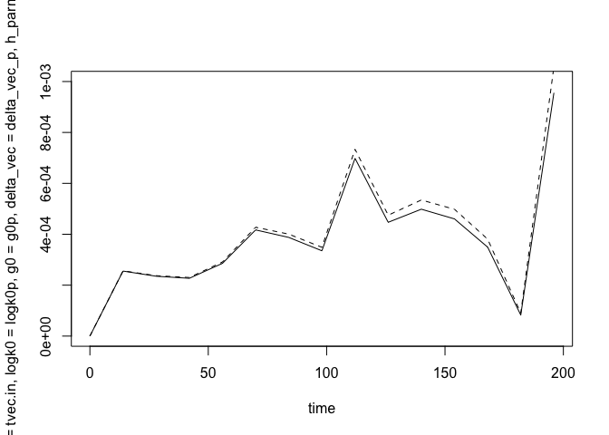
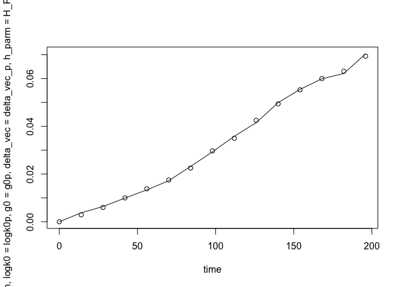

<!-- README.md is generated from README.Rmd. Please edit that file -->

# mpw

<!-- badges: start -->
<!-- badges: end -->

The goal of mpw is to estimate Marginalized Piecewise Weibull Frailty
Models in R.

## Installation

You can install the development version of mpw from
[GitHub](https://github.com/) with:

``` r
# install.packages("pak")
pak::pak("swihart/mpw")
```

## Examples

These are basic examples.

## PS($\alpha,\alpha,0$) Positive Stable Example

This is the $F_{\alpha}$ referenced in the manuscript.

``` r
library(mpw)
## basic example code

Pf.time<- c(0,  14 , 28 , 42 , 56 , 70 , 84 , 98 , 112, 126, 140, 154, 168, 182, 196)
Pf.F1  <- c(0, .18,.19 ,.22, .25 , .27, .28, .34, .44, .50, .60, .72, .75, .81, .93)/100
Pf.F0  <- c(0, .29,.60, 1.00,1.38,1.75,2.25,2.97,3.50,4.25,4.94,5.53,6.00,6.31,6.94)/100

time <- Pf.time
F1 <- Pf.F1
F0 <- Pf.F0

tvec.in <- c(7, seq(14,max(time)-14,length.out=14),max(time)-7)
init.vals <- c(log(2.4), -10, rep( 0,length(tvec.in)))


## fit F_alpha for a given H_PARM
H_PARM <- 0.72
fit_F_alpha <- function(x){mean((popavg_dist(time, 
                                            knots= tvec.in, 
                                            logk0=x[1], 
                                            g0=x[2], 
                                            delta_vec=x[-c(1,2)],
                                            h_parm = H_PARM,
                                            frailty="PS")  - F0)^2) }


plac_fit_F_alpha <- 
  optim(init.vals, fit_F_alpha,
        method="Nelder-Mead",
        control=list(maxit=1e8))
print(plac_fit_F_alpha)
#> $par
#>  [1]  -0.15799938 -10.12040145  -0.21508909   0.74768428   0.21589618
#>  [6]   0.03136962  -0.15528469   0.27388947   0.35359469   0.20431276
#> [11]  -0.03848921  -0.39518830   0.11877485  -0.05979150  -0.91393283
#> [16]  -0.27749430   0.54807831   1.84013113
#> 
#> $value
#> [1] 1.831274e-07
#> 
#> $counts
#> function gradient 
#>     1239       NA 
#> 
#> $convergence
#> [1] 0
#> 
#> $message
#> NULL

logk0p = plac_fit_F_alpha$par[1]
g0p = plac_fit_F_alpha$par[2]
delta_vec_p =plac_fit_F_alpha$par[-1*c(1,2)]
  
plot(time, 
     popavg_dist(time, knots=tvec.in, logk0=logk0p, g0=g0p, 
                 delta_vec = delta_vec_p, h_parm= H_PARM, frailty="PS"),
     type="l")
```


``` r

## plot the pop-avg (marginal) hazard:
plot(time,
     popavg_haz(time, knots=tvec.in, logk0=logk0p, g0=g0p,
                  delta_vec = delta_vec_p, h_parm= H_PARM),
     type="l", ylim=c(0,1e-3))

## plot the subject-specific hazard, fit in the presence
## of the h_parm value:

lines(time,
     subjspec_haz(time, knots=tvec.in, logk0=logk0p, g0=g0p,
                  delta_vec = delta_vec_p),
     lty=2)
```


## Gamma($\beta,\beta$) Example

This is the $F_{\beta}$ referenced in the manuscript.

``` r
library(mpw)
## basic example code

Pf.time<- c(0,  14 , 28 , 42 , 56 , 70 , 84 , 98 , 112, 126, 140, 154, 168, 182, 196)
Pf.F1  <- c(0, .18,.19 ,.22, .25 , .27, .28, .34, .44, .50, .60, .72, .75, .81, .93)/100
Pf.F0  <- c(0, .29,.60, 1.00,1.38,1.75,2.25,2.97,3.50,4.25,4.94,5.53,6.00,6.31,6.94)/100

time <- Pf.time
F1 <- Pf.F1
F0 <- Pf.F0

tvec.in <- c(7, seq(14,max(time)-14,length.out=14),max(time)-7)
init.vals <- c(log(2.4), -10, rep( 0,length(tvec.in)))

## fit F_beta for a given H_PARM
H_PARM <- 0.72
fit_F_beta <- function(x){mean((popavg_dist(time, 
                                            knots= tvec.in, 
                                            logk0=x[1], 
                                            g0=x[2], 
                                            delta_vec=x[-c(1,2)],
                                            h_parm = H_PARM,
                                            frailty="GA")  - F0)^2) }


plac_fit_F_beta <- 
  optim(init.vals, fit_F_beta,
        method="Nelder-Mead",
        control=list(maxit=1e8))
print(plac_fit_F_beta)
#> $par
#>  [1]   0.502079930 -10.040468476  -0.330061562   0.003865048  -0.336826948
#>  [6]  -0.024383734   0.250173132   0.439016976  -0.255277225  -0.234803012
#> [11]   1.061206688  -0.896795452   0.105126011  -0.138730813  -0.307526058
#> [16]  -0.739420915   1.018565747   1.429820594
#> 
#> $value
#> [1] 4.750979e-07
#> 
#> $counts
#> function gradient 
#>      999       NA 
#> 
#> $convergence
#> [1] 0
#> 
#> $message
#> NULL

logk0p = plac_fit_F_beta$par[1]
g0p = plac_fit_F_beta$par[2]
delta_vec_p =plac_fit_F_beta$par[-1*c(1,2)]
  
plot(time, 
     popavg_dist(time, knots=tvec.in, logk0=logk0p, g0=g0p, 
                 delta_vec = delta_vec_p, h_parm=1, frailty="GA"))
```


``` r

## plot the pop-avg (marginal) hazard:
plot(time,
     popavg_haz(time, knots=tvec.in, logk0=logk0p, g0=g0p,
                  delta_vec = delta_vec_p, h_parm= H_PARM),
     type="l", ylim=c(0,1e-3))

## plot the subject-specific hazard, fit in the presence
## of the h_parm value:

lines(time,
     subjspec_haz(time, knots=tvec.in, logk0=logk0p, g0=g0p,
                  delta_vec = delta_vec_p),
     lty=2)
```



## Inverse Gaussian($1,\lambda$) Example

This is the $F_{\lambda}$ referenced in the manuscript.

``` r
library(mpw)
## basic example code

Pf.time<- c(0,  14 , 28 , 42 , 56 , 70 , 84 , 98 , 112, 126, 140, 154, 168, 182, 196)
Pf.F1  <- c(0, .18,.19 ,.22, .25 , .27, .28, .34, .44, .50, .60, .72, .75, .81, .93)/100
Pf.F0  <- c(0, .29,.60, 1.00,1.38,1.75,2.25,2.97,3.50,4.25,4.94,5.53,6.00,6.31,6.94)/100

time <- Pf.time
F1 <- Pf.F1
F0 <- Pf.F0

tvec.in <- c(7, seq(14,max(time)-14,length.out=14),max(time)-7)
init.vals <- c(log(2.4), -10, rep( 0,length(tvec.in)))


## fit F_lambda
fit_F_lambda <- function(x){mean((popavg_dist(time, 
                                            knots= tvec.in, 
                                            logk0=x[1], 
                                            g0=x[2], 
                                            delta_vec=x[-c(1,2)],
                                            h_parm = 1,
                                            frailty="IG")  - F0)^2) }


plac_fit_F_lambda <- 
  optim(init.vals, fit_F_lambda,
        method="Nelder-Mead",
        control=list(maxit=1e8))
print(plac_fit_F_lambda)
#> $par
#>  [1]   0.42381785 -10.04026693   0.30477592  -0.93204217   0.17080077
#>  [6]   0.42089511  -0.07617128  -0.21360792   0.27764814   0.07622847
#> [11]   0.07230551  -0.19955429   0.17948114  -0.38741684  -0.30706273
#> [16]  -0.62559548   0.93572685   1.29233811
#> 
#> $value
#> [1] 3.955887e-07
#> 
#> $counts
#> function gradient 
#>      973       NA 
#> 
#> $convergence
#> [1] 0
#> 
#> $message
#> NULL

logk0p = plac_fit_F_lambda$par[1]
g0p = plac_fit_F_lambda$par[2]
delta_vec_p =plac_fit_F_lambda$par[-1*c(1,2)]
  
plot(time, 
     popavg_dist(time, knots=tvec.in, logk0=logk0p, g0=g0p, 
                 delta_vec = delta_vec_p, h_parm=1, frailty="IG"))
```


## Two-Point($\rho$, $\xi$) Example

This is the $F_{\rho}$ referenced in the manuscript.

``` r
library(mpw)
## basic example code

Pf.time<- c(0,  14 , 28 , 42 , 56 , 70 , 84 , 98 , 112, 126, 140, 154, 168, 182, 196)
Pf.F1  <- c(0, .18,.19 ,.22, .25 , .27, .28, .34, .44, .50, .60, .72, .75, .81, .93)/100
Pf.F0  <- c(0, .29,.60, 1.00,1.38,1.75,2.25,2.97,3.50,4.25,4.94,5.53,6.00,6.31,6.94)/100

time <- Pf.time
F1 <- Pf.F1
F0 <- Pf.F0

tvec.in <- c(7, seq(14,max(time)-14,length.out=14),max(time)-7)
init.vals <- c(log(2.4), -10, rep( 0,length(tvec.in)))

## fit F_rho
fit_F_rho <- function(x){mean((popavg_dist(time, 
                                            knots= tvec.in, 
                                            logk0=x[1], 
                                            g0=x[2], 
                                            delta_vec=x[-c(1,2)],
                                            h_parm = 0.5,
                                            frailty="TP1",
                                            xi = 0.1)  - F0)^2) }


plac_fit_F_rho <- 
  optim(init.vals, fit_F_rho,
        method="Nelder-Mead",
        control=list(maxit=1e8))
print(plac_fit_F_rho)
#> $par
#>  [1]   0.53258921 -10.08709893  -0.36675399  -0.17812802  -0.04190522
#>  [6]  -0.12539097   0.19255217   0.33051587  -0.08985874   0.18315842
#> [11]  -0.19035749   0.23253249   0.11483520  -0.88478415   0.14887439
#> [16]  -0.64588603   0.62328961   1.57113502
#> 
#> $value
#> [1] 2.487879e-07
#> 
#> $counts
#> function gradient 
#>      763       NA 
#> 
#> $convergence
#> [1] 0
#> 
#> $message
#> NULL

logk0p = plac_fit_F_rho$par[1]
g0p = plac_fit_F_rho$par[2]
delta_vec_p =plac_fit_F_rho$par[-1*c(1,2)]
  
plot(time, 
     popavg_dist(time, knots=tvec.in, logk0=logk0p, g0=g0p, 
                 delta_vec = delta_vec_p, h_parm=0.5, frailty="TP1", xi = 0.1))
```


## Two-Point($\omega$, $n$, $s$) Example

This is the $F_{\omega}$ referenced in the manuscript.

``` r
library(mpw)
## basic example code

Pf.time<- c(0,  14 , 28 , 42 , 56 , 70 , 84 , 98 , 112, 126, 140, 154, 168, 182, 196)
Pf.F1  <- c(0, .18,.19 ,.22, .25 , .27, .28, .34, .44, .50, .60, .72, .75, .81, .93)/100
Pf.F0  <- c(0, .29,.60, 1.00,1.38,1.75,2.25,2.97,3.50,4.25,4.94,5.53,6.00,6.31,6.94)/100

time <- Pf.time
F1 <- Pf.F1
F0 <- Pf.F0

tvec.in <- c(7, seq(14,max(time)-14,length.out=14),max(time)-7)
init.vals <- c(log(2.4), -10, rep( 0,length(tvec.in)))


fit_F_omega <- function(x){mean((popavg_dist(time, 
                                            knots= tvec.in, 
                                            logk0=x[1], 
                                            g0=x[2], 
                                            delta_vec=x[-c(1,2)],
                                            h_parm = 0.50,
                                            frailty="TPU",
                                            n=0.25,
                                            s=4.00)  - F0)^2) }


plac_fit_F_omega <- 
  optim(init.vals, fit_F_omega,
        method="Nelder-Mead",
        control=list(maxit=1e8))
print(plac_fit_F_omega)
#> $par
#>  [1]  0.48099077 -9.97182403 -0.91909126  0.05937541  0.33699959 -0.01413072
#>  [7] -0.17026103  0.81246434 -0.14277889 -0.04705732  0.03813736 -0.45175104
#> [13]  1.01934966 -1.27666904  0.08861910 -0.51736433  0.95470678  0.83804581
#> 
#> $value
#> [1] 3.751629e-07
#> 
#> $counts
#> function gradient 
#>     1035       NA 
#> 
#> $convergence
#> [1] 0
#> 
#> $message
#> NULL

logk0p = plac_fit_F_omega$par[1]
g0p = plac_fit_F_omega$par[2]
delta_vec_p =plac_fit_F_omega$par[-1*c(1,2)]
  
plot(time, 
     popavg_dist(time, knots=tvec.in, logk0=logk0p, g0=g0p, 
                 delta_vec = delta_vec_p, h_parm=0.50, frailty="TPU",
                 n=0.25, s=4.00))
```


