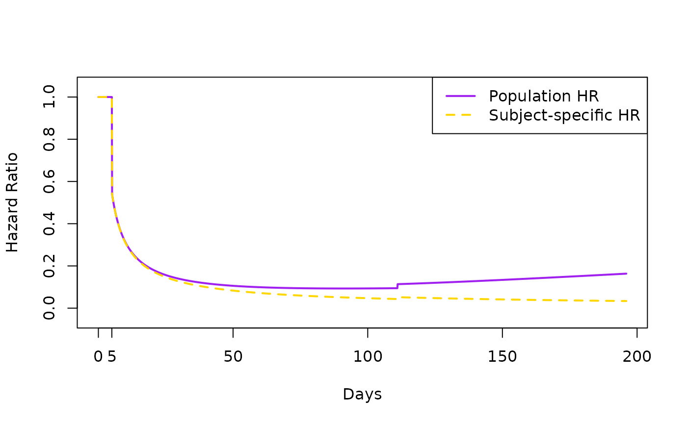
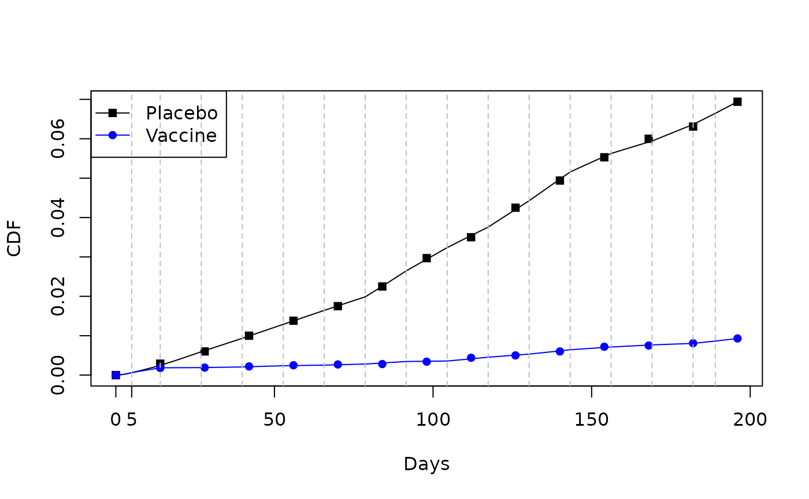
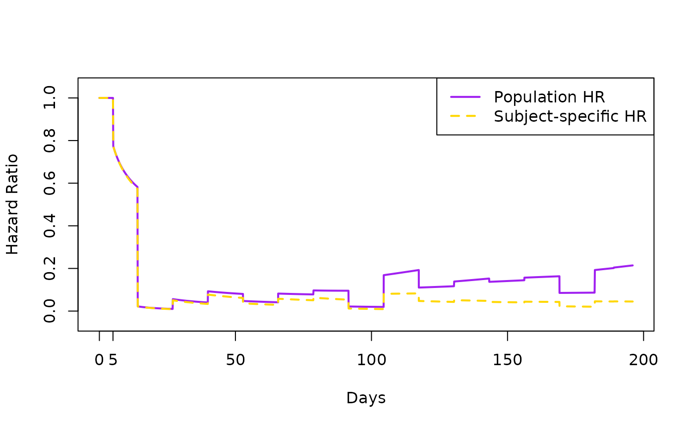

# Burr-Weibull-Gamma

## GA($\beta,\beta$) Gamma Frailty Example

This is the $F_{\beta}$ referenced in the manuscript:

- $F_{\beta}(x) = 1 - \left\lbrack 1 + \frac{1}{\beta}\exp\eta \right\rbrack^{- \beta}$

This is the GA($\beta,\beta$) Gamma Frailty density:

- $f_{u_{i}}\left( u_{i}|\beta \right) = \frac{\beta^{\beta}}{\Gamma(\beta)}u_{i}^{\beta - 1}\exp\left( - \beta u_{i} \right)$

We analyze data that looks similar to that of Figure 2 [Thomas et al
(2021) *Safety and Efficacy of the BNT162b2 mRNA Covid-19 Vaccine
through 6 Months*](https://pubmed.ncbi.nlm.nih.gov/34525277/).

We plot the data points, color-code the groups, and just connect the
dots with interpolated, dashed lines.

``` r
library(mpw)
## This data resembles Figure 2 in Thomas et al
## https://pubmed.ncbi.nlm.nih.gov/34525277/
time<- c(0,14,28,42,56,70,84,98,112,126,140,154,168,182,196)
F1  <- c(0,.18,.19,.22,.25,.27,.28,.34,.44,.50,.60,.72,.75,.81,.93)/100
F0  <- c(0,.29,.60,1,1.38,1.75,2.25,2.97,3.50,4.25,4.94,5.53,6.00,6.31,6.94)/100

## plot the data points, 
## with interpolated lines
plot  (time, F0, type="l", col="black", xlab="Days", ylab="CDF", lty=2)
points(time, F0, col="black", pch=15)
lines (time, F1, col="blue", lty=2)
points(time, F1, col="blue", pch=16)
legend("topleft", c("Placebo", "Vaccine"),
       col=c("black","blue"),
       lty=1,
       pch=c(15,16)
)
```


Set the `h_parm` and `frailty` distribution for this example. Beware
that H_PARM has different bounds depending on what value of FRAILTY is
selected.

``` r
H_PARM <- 0.04
FRAILTY <- "GA"
```

We first consider two knots which will allow us to model each curve with
three pieces. We set the first piece of each group to be equal so we can
get an HR of 1 (more in subsequent sections). This first piece can be
specified to be over a short time range where both groups would be
considered equal due to the *ramp-up time* of a vaccine. Below we set
the ramp-up time to end 5 days after first dose, the second piece to go
from then to 90 days after second dose, and the third piece from then
until the end of the study. We do this by specifying two knot values, as
below:

### Two knots

``` r
tvec.in <- c(5, 90+21)
tvec.in
#> [1]   5 111
```

#### Two step fitting procedure

##### 1. Fit for placebo group

``` r
fit_F_beta <- function(x){mean((popavg_dist(time, 
                                            knots= tvec.in, 
                                            logk0=x[1], 
                                            g0=x[2], 
                                            delta_vec=x[-c(1,2)],
                                            h_parm = H_PARM,
                                            frailty=FRAILTY)  - F0)^2) }

init.vals <- c(log(2.4), -10, rep( 0,length(tvec.in)))
plac_fit_F_beta <- 
  optim(init.vals, fit_F_beta,
        method="Nelder-Mead",
        control=list(maxit=1e8))
print(plac_fit_F_beta)
#> $par
#> [1]   0.3539405 -10.7669066   0.3857141   0.4338531
#> 
#> $value
#> [1] 1.498077e-06
#> 
#> $counts
#> function gradient 
#>      153       NA 
#> 
#> $convergence
#> [1] 0
#> 
#> $message
#> NULL

logk0p = plac_fit_F_beta$par[1]
g0p = plac_fit_F_beta$par[2]
delta_vec_p =plac_fit_F_beta$par[-1*c(1,2)]
```

##### 2. Fit for vaccine group

Now take `logk0p` and `g0p`, the parameters that control the first
(leftmost) piece for the placebo group and use them for `logk0v` and
`g0v` when estimating the pieces for the vaccine group. This forces the
first pieces to be the same for both groups (i.e. *ramp-up time*).

``` r
fit_F_beta <- function(x){mean((popavg_dist(time, 
                                            knots= tvec.in, 
                                            logk0=logk0p, 
                                            g0=g0p, 
                                            delta_vec=x,
                                            h_parm = H_PARM,
                                            frailty=FRAILTY)  - F1)^2) }

init.vals <- rep( 0,length(tvec.in))
vacc_fit_F_beta <- 
  optim(init.vals, fit_F_beta,
        method="Nelder-Mead",
        control=list(maxit=1e8))
print(vacc_fit_F_beta)
#> $par
#> [1] -0.4327863  0.4862969
#> 
#> $value
#> [1] 2.11765e-07
#> 
#> $counts
#> function gradient 
#>       61       NA 
#> 
#> $convergence
#> [1] 0
#> 
#> $message
#> NULL

logk0v = logk0p
g0v = g0p
delta_vec_v =vacc_fit_F_beta$par
```

#### Plot population avg CDF

- Quick check of fit

We use the knots and the original time in `time.dist` to do a quick
check of the fit. We put vertical dashed lines in the plot to denote
knot placement.

``` r
time.dist <- sort(c(seq(min(c(time, tvec.in)), 
                        max(c(time, tvec.in)), 0.1),
                    tvec.in)
                  )

plac.dist <- popavg_dist(      x = time.dist, 
                           knots = tvec.in,
                           logk0 = logk0p,
                              g0 = g0p,
                       delta_vec = delta_vec_p,
                          h_parm = H_PARM,
                         frailty = FRAILTY)

vacc.dist <- popavg_dist(      x = time.dist, 
                           knots = tvec.in,
                           logk0 = logk0v,
                              g0 = g0v,
                       delta_vec = delta_vec_v,
                          h_parm = H_PARM,
                         frailty = FRAILTY)
  
plot  (time.dist, plac.dist, type="l", col="black", xlab="Days", ylab="CDF")
points(time     , F0       , col="black", pch=15)
lines (time.dist, vacc.dist, col="blue")
points(time     , F1, col="blue", pch=16)
abline(v=tvec.in, lty=2, col="grey")
legend("topleft", c("Placebo", "Vaccine"),
       col=c("black","blue"),
       lty=1,
       pch=c(15,16)
)
axis(1, at=c(tvec.in[1]))
```


Note from Days 0 to 5 the curves are the same. Over this range the HR
will be 1. Otherwise the fit looks okay – some points are below their
line and some are above.

#### Plot population avg HR

- uses parameters from two step fitting procedure
- HR(0) = 1

We use the parameters of the previous fits to estimate the population
average hazard, which we can fit with
[`mpw::popavg_haz()`](https://swihart.github.io/mpw/reference/popavg_haz.md).
We adjust the time input so that the first element is just above 0.

``` r
time.haz <- c(1e-4, time.dist[-1])
plac.haz <- popavg_haz(      x = time.haz, 
                           knots = tvec.in,
                           logk0 = logk0p,
                              g0 = g0p,
                       delta_vec = delta_vec_p,
                          h_parm = H_PARM,
                         frailty = FRAILTY)

vacc.haz <- popavg_haz(      x = time.haz, 
                           knots = tvec.in,
                           logk0 = logk0v,
                              g0 = g0v,
                       delta_vec = delta_vec_v,
                          h_parm = H_PARM,
                         frailty = FRAILTY)

plot  (time.haz, vacc.haz/plac.haz, type="l", col="purple", xlab="Days",
       ylab="Hazard Ratio", lwd=2, ylim=c(-0.05,1.05))

abline(v=tvec.in, lty=2, col="grey")

axis(1, at=c(tvec.in[1]))
```


#### Add subject-specific HRs

- should flatten

The function
[`mpw::subjspec_haz()`](https://swihart.github.io/mpw/reference/subjspec_haz.md)
does not require the arguments `frailty` or `h_parm` because it takes
the inputs for the b,k, and delta pieces and models the subject-specific
(aka conditional) hazard. Doing this for the placebo group, then the
vaccine group and dividing them gives the subject-specific hazard ratio
(HR).

``` r
plac.haz.ss <- subjspec_haz(      x = time.haz, 
                           knots = tvec.in,
                           logk0 = logk0p,
                              g0 = g0p,
                       delta_vec = delta_vec_p)

vacc.haz.ss <- subjspec_haz(      x = time.haz, 
                           knots = tvec.in,
                           logk0 = logk0v,
                              g0 = g0v,
                       delta_vec = delta_vec_v)

plot  (time.haz, vacc.haz/plac.haz, type="l", col="purple", xlab="Days",
       ylab="Hazard Ratio", lwd=2, ylim=c(-0.05,1.05))

axis(1, at=c(tvec.in[1]))

lines  (time.haz, vacc.haz.ss/plac.haz.ss, type="l", col="gold", xlab="Days",
        lwd=2, lty=2)
legend("topright", c("Population HR", "Subject-specific HR"),
       col=c("purple","gold"),
       lty=c(1,2),
       lwd=2
)
```



The plot above shows that for a positive-stable frailty with $\beta$ =
0.04 the subject-specific HR is flatter and lower than the population
average HR.

### Sixteen knots

By increasing the knots, we get a “higher resolution” fit.

``` r
tvec.in <- c(5, seq(14,max(time)-14,length.out=14),max(time)-7)
tvec.in
#>  [1]   5.00000  14.00000  26.92308  39.84615  52.76923  65.69231  78.61538
#>  [8]  91.53846 104.46154 117.38462 130.30769 143.23077 156.15385 169.07692
#> [15] 182.00000 189.00000
```

#### Two step fitting procedure

##### 1. Fit for placebo group

``` r
fit_F_beta <- function(x){mean((popavg_dist(time, 
                                            knots= tvec.in, 
                                            logk0=x[1], 
                                            g0=x[2], 
                                            delta_vec=x[-c(1,2)],
                                            h_parm = H_PARM,
                                            frailty=FRAILTY)  - F0)^2) }

init.vals <- c(log(2.4), -10, rep( 0,length(tvec.in)))
plac_fit_F_beta <- 
  optim(init.vals, fit_F_beta,
        method="Nelder-Mead",
        control=list(maxit=1e8))
print(plac_fit_F_beta)
#> $par
#>  [1]   0.523256884 -10.061980989  -0.343286973   0.051466952  -0.120790053
#>  [6]   0.042242352   0.019460319  -0.006109866   1.183818242  -0.316110532
#> [11]  -0.234160335   0.613497081   0.294034546  -0.951672983  -0.560057694
#> [16]   0.549708194   0.562404770   0.146431026
#> 
#> $value
#> [1] 1.219135e-07
#> 
#> $counts
#> function gradient 
#>     2923       NA 
#> 
#> $convergence
#> [1] 0
#> 
#> $message
#> NULL

logk0p = plac_fit_F_beta$par[1]
g0p = plac_fit_F_beta$par[2]
delta_vec_p =plac_fit_F_beta$par[-1*c(1,2)]
```

##### 2. Fit for vaccine group

Now take `logk0p` and `g0p`, the parameters that control the first
(leftmost) piece for the placebo group and use them for `logk0v` and
`g0v` when estimating the pieces for the vaccine group. This forces the
first pieces to be the same for both groups (i.e. *ramp-up time*).

``` r
fit_F_beta <- function(x){mean((popavg_dist(time, 
                                            knots= tvec.in, 
                                            logk0=logk0p, 
                                            g0=g0p, 
                                            delta_vec=x,
                                            h_parm = H_PARM,
                                            frailty=FRAILTY)  - F1)^2) }

init.vals <- rep( 0,length(tvec.in))
vacc_fit_F_beta <- 
  optim(init.vals, fit_F_beta,
        method="Nelder-Mead",
        control=list(maxit=1e8))
print(vacc_fit_F_beta)
#> $par
#>  [1] -0.6409172 -1.0051289  0.1717533  0.2957642 -0.2042821  0.2995559
#>  [7]  0.8121162 -1.1376272  1.8870262 -0.5380177  0.5290840 -0.8612000
#> [13] -0.3007488 -0.2667314  1.3707537  0.1496222
#> 
#> $value
#> [1] 1.757205e-08
#> 
#> $counts
#> function gradient 
#>     2471       NA 
#> 
#> $convergence
#> [1] 0
#> 
#> $message
#> NULL

logk0v = logk0p
g0v = g0p
delta_vec_v =vacc_fit_F_beta$par
```

#### Plot population avg CDF

- Quick check of fit

We use the knots and the original time in `time.dist` to do a quick
check of the fit. We put vertical dashed lines in the plot to denote
knot placement.

``` r
time.dist <- sort(c(seq(min(c(time, tvec.in)), 
                        max(c(time, tvec.in)), 0.1),
                    tvec.in)
                  )

plac.dist <- popavg_dist(      x = time.dist, 
                           knots = tvec.in,
                           logk0 = logk0p,
                              g0 = g0p,
                       delta_vec = delta_vec_p,
                          h_parm = H_PARM,
                         frailty = FRAILTY)

vacc.dist <- popavg_dist(      x = time.dist, 
                           knots = tvec.in,
                           logk0 = logk0v,
                              g0 = g0v,
                       delta_vec = delta_vec_v,
                          h_parm = H_PARM,
                         frailty = FRAILTY)
  
plot  (time.dist, plac.dist, type="l", col="black", xlab="Days", ylab="CDF")
points(time     , F0       , col="black", pch=15)
lines (time.dist, vacc.dist, col="blue")
points(time     , F1, col="blue", pch=16)
abline(v=tvec.in, lty=2, col="grey")
legend("topleft", c("Placebo", "Vaccine"),
       col=c("black","blue"),
       lty=1,
       pch=c(15,16)
)
axis(1, at=c(tvec.in[1]))
```



Note from Days 0 to 5 the curves are the same. Comparing with the two
knot example, the fit is much improved.

#### Plot population avg HR

- uses parameters from two step fitting procedure
- HR(0) = 1

We use the parameters of the previous fits to estimate the population
average hazard, which we can fit with
[`mpw::popavg_haz()`](https://swihart.github.io/mpw/reference/popavg_haz.md).
We adjust the time input so that the first element is just above 0.

``` r
time.haz <- c(1e-4, time.dist[-1])
plac.haz <- popavg_haz(      x = time.haz, 
                           knots = tvec.in,
                           logk0 = logk0p,
                              g0 = g0p,
                       delta_vec = delta_vec_p,
                          h_parm = H_PARM,
                         frailty = FRAILTY)

vacc.haz <- popavg_haz(      x = time.haz, 
                           knots = tvec.in,
                           logk0 = logk0v,
                              g0 = g0v,
                       delta_vec = delta_vec_v,
                          h_parm = H_PARM,
                         frailty = FRAILTY)

plot  (time.haz, vacc.haz/plac.haz, type="l", col="purple", xlab="Days", ylab="Hazard Ratio", lwd=2, ylim=c(-0.05,1.05))

abline(v=tvec.in, lty=2, col="grey")

axis(1, at=c(tvec.in[1]))
```


#### Add subject-specific HRs

- should flatten

The function
[`mpw::subjspec_haz()`](https://swihart.github.io/mpw/reference/subjspec_haz.md)
does not require the arguments `frailty` or `h_parm` because it takes
the inputs for the b,k, and delta pieces and models the subject-specific
(aka conditional) hazard. Doing this for the placebo group, then the
vaccine group and dividing them gives the subject-specific hazard ratio
(HR).

``` r
plac.haz.ss <- subjspec_haz(      x = time.haz, 
                           knots = tvec.in,
                           logk0 = logk0p,
                              g0 = g0p,
                       delta_vec = delta_vec_p)

vacc.haz.ss <- subjspec_haz(      x = time.haz, 
                           knots = tvec.in,
                           logk0 = logk0v,
                              g0 = g0v,
                       delta_vec = delta_vec_v)

plot  (time.haz, vacc.haz/plac.haz, type="l", col="purple", xlab="Days",
       ylab="Hazard Ratio", lwd=2, ylim=c(-0.05,1.05))

axis(1, at=c(tvec.in[1]))

lines  (time.haz, vacc.haz.ss/plac.haz.ss, type="l", col="gold", xlab="Days",
        lwd=2, lty=2)
legend("topright", c("Population HR", "Subject-specific HR"),
       col=c("purple","gold"),
       lty=c(1,2),
       lwd=2
)
```



The plot above shows that for a gamma frailty with $\beta$ = 0.04 the
subject-specific HR is flatter and lower than the population average HR.
