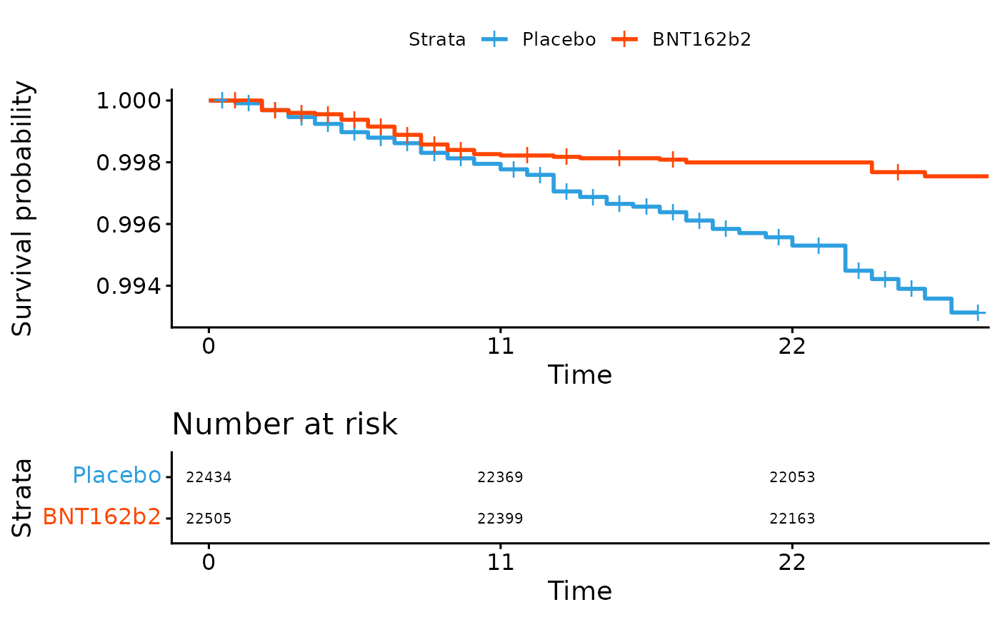
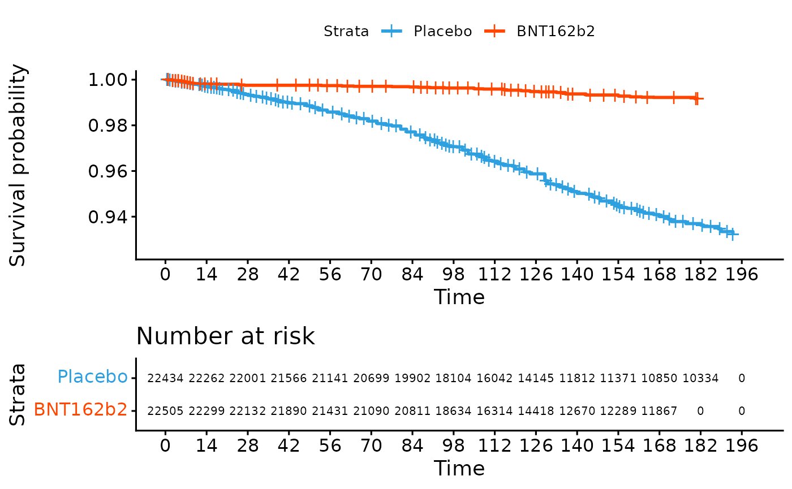
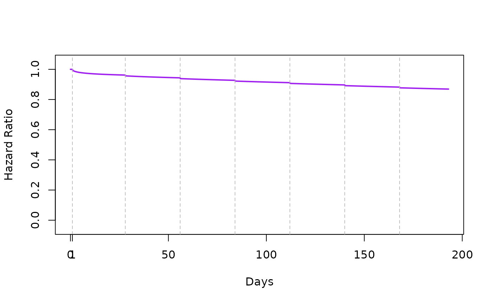
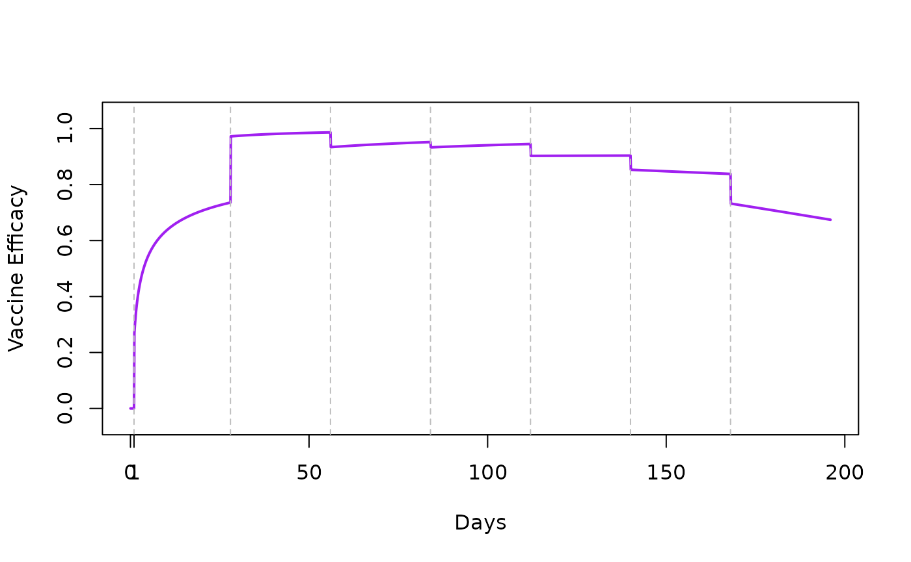

# Fay et al. (2025) supporting materials

In Fay et al. (2025) *Vaccine Efficacy Estimands for Individual
Randomized Field Trials*, the $\frac{1}{\alpha}$ approach is used. In
this approach which utilizes the “Weibull-Weibull-Positive Stable”
model, the population (marginal) Weibull is estimated, and then
$\frac{1}{\alpha}$ is applied to those estimates to render the
individual-level (conditional) Weibull. This code recreates Figure 6 in
that paper using `mpw` calls.

The Weibull-Weibull-Positive Stable has a feature that the other mpw
frailty models do not have: that is, the marginal distribution (Weibull)
is the same as the conditional distribution (also Weibull). This enables
a strategy of estimating the mpw on the population data without
specifying an $\alpha$ (this is done in practice by setting `alpha=1`)
and then from there one can exactly calculate corresponding conditional
models (and HRs, and VEs, etc) using $\frac{1}{\alpha}$ applied to the
*marginal* $b$ and $k$ estimates.

Explicitly, the hazard ratio for an individual, $\theta_{I}$, can be
produced by:

$$\frac{b_{1}^{1/\alpha}\left( k_{1}/\alpha \right)t^{{(k_{1}/\alpha)} - 1}}{b_{0}^{1/\alpha}\left( k_{0}/\alpha \right)t^{{(k_{0}/\alpha)} - 1}} = \theta_{I}$$

More details for the interested reader can be found in [Swihart &
Bandyopadhyay
(2021)](https://www.sciencedirect.com/science/article/pii/S0169260721001905?casa_token=xYzQZ9UfxGMAAAAA:vFpj08P43bUx_7BTN21cSUksK_WSyQdjIBhWHS7VG8u5ctGB91gDzE8-NJtMblcut67jD6k),
particularly in Section 2.1.

## PS($\alpha,\alpha,0$) Positive Stable Frailty Example

This is the $F_{\alpha}$, the marginalized piecewise Weibull CDF:

- $F_{\alpha}(x) = 1 - \exp\left\lbrack - \exp\alpha\eta \right\rbrack$

The CDF above is the result of integrating a piecewise weibull frailty
model where the frailty has the PS($\alpha,\alpha,0$) Positive Stable
Frailty density:

- $f_{u_{i}}\left( u_{i}|\alpha \right) = - \frac{1}{\pi u_{i}}\sum_{k = 1}^{\infty}\frac{\Gamma(k\alpha + 1)}{k!}\left( - u_{i}^{- \alpha} \right)^{k}\sin(\alpha k\pi)$

We analyze data that looks similar to that of Figure 2 [Thomas et al
(2021) *Safety and Efficacy of the BNT162b2 mRNA Covid-19 Vaccine
through 6 Months*](https://pubmed.ncbi.nlm.nih.gov/34525277/).

We accomplished creating the dataset in this package, `ipd_data` by
using the R package `IPDfromKM`.

We load the data and do a couple of quick checks before proceeding with
the core of our example.

``` r
library(survminer)
library(survival)
library(mpw)

data(ipd_data)
dim(ipd_data)
#> [1] 44939     3
head(ipd_data)
#>   time status treat
#> 1  0.5      0     0
#> 2  1.0      1     0
#> 3  1.0      1     0
#> 4  1.5      0     0
#> 5  1.5      0     0
#> 6  2.0      1     0


fit <- survfit(Surv(time, status) ~ treat,
               data = ipd_data)
## zoomed in, inset, 11days
# Visualize with survminer
ggsurvplot(fit, data = ipd_data, risk.table = TRUE, 
           ylim=c(1,0.993), xlim=c(0,28), break.time.by=11,
           fontsize=2.7,tables.height = 0.50)
```



``` r

# Visualize with survminer
## full view; every 14 days
ggsurvplot(fit, data = ipd_data, risk.table = TRUE, 
           ylim=c(1,0.925), break.time.by=14,
           fontsize=2.7, tables.height = 0.50)
```



``` r


## This data resembles Figure 2 in Thomas et al
## https://pubmed.ncbi.nlm.nih.gov/34525277/
time<- c(0,14,28,42,56,70,84,98,112,126,140,154,168,182,196)
F1  <- c(0,.18,.19,.22,.25,.27,.28,.34,.44,.50,.60,.72,.75,.81,.93)/100
F0  <- c(0,.29,.60,1,1.38,1.75,2.25,2.97,3.50,4.25,4.94,5.53,6.00,6.31,6.94)/100

## plot the data points, 
## with interpolated lines
plot  (time, F0, type="l", col="black", xlab="Days", ylab="CDF", lty=2)
points(time, F0, col="black", pch=15)
lines (time, F1, col="blue", lty=2)
points(time, F1, col="blue", pch=16)
legend("topleft", c("Placebo", "Vaccine"),
       col=c("black","blue"),
       lty=1,
       pch=c(15,16)
)
```


Set the `h_parm` and `frailty` distribution for this example. Beware
that H_PARM has different bounds depending on what value of FRAILTY is
selected. For this example, we are going to estimate the marginal
parameters first and can accomplish this by mitigating the effect of
alpha, that is, setting the global variable `H_PARM=1.00` which will be
passed to the argument `h_parm`.

``` r
H_PARM <- 1.00
FRAILTY <- "PS"
```

We first consider two knots which will allow us to model each curve with
three pieces. We set the first piece of each group to be equal so we can
get an HR of 1 (more in subsequent sections). This first piece can be
specified to be over a short time range where both groups would be
considered equal due to the *ramp-up time* of a vaccine. Below we set
the ramp-up time to end 1 day after first dose, the second piece to go
from then to 28 days after the first dose, and the third piece from then
56 days after the first dose, etc.

### Knot selection

``` r
tvec.in<- c(1,28,56,84,112,140,168)
tvec.in
#> [1]   1  28  56  84 112 140 168
```

#### Two step fitting procedure

##### 1. Fit for placebo group

``` r
fit_F_alpha <- function(x){mean((popavg_dist(time, 
                                            knots= tvec.in, 
                                            logk0=x[1], 
                                            g0=x[2], 
                                            delta_vec=x[-c(1,2)],
                                            h_parm = H_PARM,
                                            frailty=FRAILTY)  - F0)^2) }

init.vals <- c(log(2.4), -10, rep( 0,length(tvec.in)))
plac_fit_F_alpha <- 
  optim(init.vals, fit_F_alpha,
        method="Nelder-Mead",
        control=list(maxit=1e8))
print(plac_fit_F_alpha)
#> $par
#> [1]  0.1602199 -9.4498573  0.1816194 -0.6323941  1.1084249 -0.6612064  0.5807145
#> [8] -0.8614969  0.2335560
#> 
#> $value
#> [1] 9.918573e-07
#> 
#> $counts
#> function gradient 
#>      479       NA 
#> 
#> $convergence
#> [1] 0
#> 
#> $message
#> NULL

logk0p = plac_fit_F_alpha$par[1]
g0p = plac_fit_F_alpha$par[2]
delta_vec_p =plac_fit_F_alpha$par[-1*c(1,2)]
```

##### 2. Fit for vaccine group

Now take `logk0p` and `g0p`, the parameters that control the first
(leftmost) piece for the placebo group and use them for `logk0v` and
`g0v` when estimating the pieces for the vaccine group. This forces the
first pieces to be the same for both groups (i.e. *ramp-up time*).

``` r
fit_F_alpha <- function(x){mean((popavg_dist(time, 
                                            knots= tvec.in, 
                                            logk0=logk0p, 
                                            g0=g0p, 
                                            delta_vec=x,
                                            h_parm = H_PARM,
                                            frailty=FRAILTY)  - F1)^2) }

init.vals <- rep( 0,length(tvec.in))
vacc_fit_F_alpha <- 
  optim(init.vals, fit_F_alpha,
        method="Nelder-Mead",
        control=list(maxit=1e8))
print(vacc_fit_F_alpha)
#> $par
#> [1] -0.18224579 -0.82329339  0.23464110  1.05260310  0.01773164 -0.06979188
#> [7] -0.30021721
#> 
#> $value
#> [1] 6.401134e-08
#> 
#> $counts
#> function gradient 
#>      436       NA 
#> 
#> $convergence
#> [1] 0
#> 
#> $message
#> NULL

logk0v = logk0p
g0v = g0p
delta_vec_v =vacc_fit_F_alpha$par
```

#### Plot population avg CDF

- Quick check of fit

We use the knots and the original time in `time.dist` to do a quick
check of the fit. We put vertical dashed lines in the plot to denote
knot placement.

``` r
COL <- c("black","grey")
LTY <- c(1,1)
LWD <- c(2,6)
plot(NA,NA,, type="l", col="black", lwd=2, ylim=c(0,0.08), ylab="Cumulative Incidence",xlab="Day since Receipt of First Dose", 
        main=c("Specified Knots: ",paste(round(tvec.in,1), collapse=", ")), xlim=range(time))

time.dist <- sort(c(seq(min(c(time, tvec.in)), 
                        max(c(time, tvec.in)), 0.1),
                    tvec.in)
                  )


plac.dist <- popavg_dist(      x = time.dist, 
                           knots = tvec.in,
                           logk0 = logk0p,
                              g0 = g0p,
                       delta_vec = delta_vec_p,
                          h_parm = H_PARM,
                         frailty = FRAILTY)

vacc.dist <- popavg_dist(      x = time.dist, 
                           knots = tvec.in,
                           logk0 = logk0v,
                              g0 = g0v,
                       delta_vec = delta_vec_v,
                          h_parm = H_PARM,
                         frailty = FRAILTY)


  lines(c(0,time.dist), c(0,vacc.dist),  col=COL[2],lty=LTY[2],lwd=LWD[2])


points(time, F1, col="blue")
abline(v=tvec.in, lty=2, col="grey")

points(time, F0, col="black")

  lines(c(0,time.dist), c(0,plac.dist),  col=COL[1],lty=LTY[1],lwd=LWD[1])
legend("topleft",legend=c(expression(F[0](t)),expression(F[1](t))),col=COL,
       lty=LTY,lwd=LWD)
```


Note from Days 0 to 1 the curves are the same. Over this range the HR
will be 1. Additionally, the fit looks okay – some points are below
their line and some are above.

#### Plot population avg HR

- uses parameters from two step fitting procedure
- HR(0) = 1

We use the parameters of the previous fits to estimate the population
average hazard, which we can fit with
[`mpw::popavg_haz()`](https://swihart.github.io/mpw/reference/popavg_haz.md).
We adjust the time input so that the first element is just above 0.

``` r
time.haz <- c(1e-4, time.dist[-1])
plac.haz <- popavg_haz(      x = time.haz, 
                           knots = tvec.in,
                           logk0 = logk0p,
                              g0 = g0p,
                       delta_vec = delta_vec_p,
                          h_parm = H_PARM,
                         frailty = FRAILTY)

vacc.haz <- popavg_haz(      x = time.haz, 
                           knots = tvec.in,
                           logk0 = logk0v,
                              g0 = g0v,
                       delta_vec = delta_vec_v,
                          h_parm = H_PARM,
                         frailty = FRAILTY)

plot  (time.haz, vacc.haz/plac.haz, type="l", col="purple", xlab="Days",
       ylab="Hazard Ratio", lwd=2, ylim=c(-0.05,1.05))

abline(v=tvec.in, lty=2, col="grey")

axis(1, at=c(tvec.in[1]))
```



Or, plot the VE = 1-HR:

``` r
plot  (time.haz, 1-vacc.haz/plac.haz, type="l", col="purple", xlab="Days",
       ylab="Vaccine Efficacy", lwd=2, ylim=c(-0.05,1.05))

abline(v=tvec.in, lty=2, col="grey")

axis(1, at=c(tvec.in[1]))
```



#### Plot subject-specific VEs for different $\alpha$ values

- should flatten

In other articles on this website demonstrating `mpw` use cases, adding
subject specific curves involves the
[`mpw::subjspec_haz()`](https://swihart.github.io/mpw/reference/subjspec_haz.md)
function. In the $\frac{1}{\alpha}$ approach, we instead use
[`mpw::popavg_haz()`](https://swihart.github.io/mpw/reference/popavg_haz.md)
specifying h_parm as 1/alpha to plot the subject specific curve.

To demonstrate how the individual-level VE might be different than the
population-level, the code below runs a loop for three specific values
of alpha:

``` r
COL<- gray(c(0.7,.5,0))
LTY<-c(1,2,3)
LWD<-c(6,4,2)

plot(NA,NA,, type="l", col="black", lwd=2, ylim=c(0,1), ylab=expression(VE[h]),xlab="Days since Receipt of First Dose", main=c("Specified knots: ",paste(round(tvec.in,1), collapse=", ")), xlim=range(time))

##set alpha.vec here to plot different conditionals
alpha.vec <- c(0.4,0.7,0.99)

## now plot
for(i in 1:length(alpha.vec)){
  
  
  a.in <- alpha.vec[i]
  

plac.haz <- popavg_haz(      x = time.haz, 
                           knots = tvec.in,
                           logk0 = logk0p,
                              g0 = g0p,
                       delta_vec = delta_vec_p,
                          h_parm = 1/a.in,
                         frailty = FRAILTY)

vacc.haz <- popavg_haz(      x = time.haz, 
                           knots = tvec.in,
                           logk0 = logk0v,
                              g0 = g0v,
                       delta_vec = delta_vec_v,
                          h_parm = 1/a.in,
                         frailty = FRAILTY)


lines(time.haz, 1-vacc.haz/plac.haz, col=COL[i],lty=LTY[i],lwd=LWD[i])

abline(v=tvec.in, lty=2, col="grey")

}
legend("bottomright",legend=paste0("alpha=",alpha.vec),lty=LTY,lwd=LWD,col=COL)
```


The plot above shows that for a positive-stable frailty, as $\alpha$
goes to 0 the subject-specific VE is flatter, approaching VE=1. As
$\alpha$ goes to 1 the VE for an individual approaches that of the
population. Conceptually, one might conclude VE is waning over time if
alpha is 0.99. One would not conclude that if alpha was 0.40. In both
instances, the same population-level VE would be observed. Therefore the
takeaway is to not make statements about VE looking at population-level
curves.
